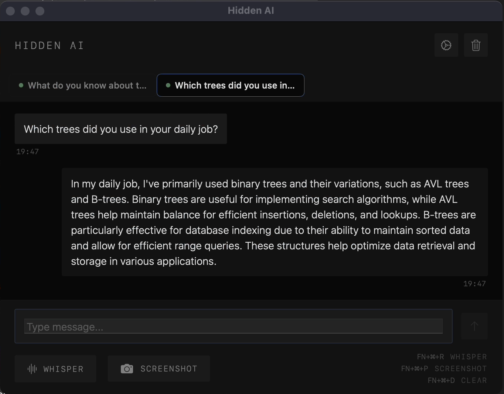

# HiddenAI

A macOS application that creates a floating, hideable window for interacting with OpenAI's GPT-4o. Capture screenshots, record audio, and get AI assistance directly on your desktop.



## Features

- **Floating Window**: Create a window that can be toggled with keyboard shortcuts (Cmd+B)
- **Screenshot Analysis**: Capture your screen and get AI analysis (Cmd+P)
- **Audio Transcription**: Record audio and transcribe with Whisper (Cmd+R)
- **Text Conversations**: Chat directly with GPT-4o
- **Customizable Context**: Configure the AI's system message for your specific needs
- **Window Management**: Adjust transparency, move with keyboard shortcuts, and toggle click-through mode

## Requirements

- macOS 12.0+
- Xcode 14.0+ (for building from source)
- OpenAI API Key

## Installation

### Option 1: Download the Release

1. Download the latest release from the [Releases](https://github.com/insearcher/HiddenAI/releases) page
2. Mount the DMG by double-clicking it
3. Drag the HiddenAI application to your Applications folder
4. When you first try to open the app, right-click (or Control-click) on the app icon and select "Open"
5. Click "Open" in the dialog box that appears (this is needed because the app is not signed with an Apple Developer ID)
6. Enter your OpenAI API key in Settings

### Option 2: Build from Source

1. Clone the repository:
   ```bash
   git clone https://github.com/insearcher/hiddenai.git
   cd hiddenai
   ```

2. Open the project in Xcode:
   ```bash
   open HiddenAIClient.xcodeproj
   ```

3. Build and run the application (⌘R)

## Usage

### Keyboard Shortcuts

- **⌘+B**: Toggle window visibility
- **⌘+R**: Toggle Whisper transcription (voice recording)
- **⌘+P**: Capture screenshot for AI analysis
- **⌘+Arrow Keys**: Move window around the screen
- **⌘+Q**: Quit application

### Configuration

1. Click the gear icon to open Settings
2. Enter your OpenAI API key
3. Customize your AI context
4. Adjust window transparency

### Permissions

The application requires the following permissions:

- **Microphone**: For audio recording with Whisper
- **Screen Recording**: For capturing screenshots
- **Accessibility**: For global keyboard shortcuts

## Privacy & Security

- Your OpenAI API key is stored locally in UserDefaults
- Audio recordings are temporarily saved to your local disk during transcription
- No data is sent to any server except OpenAI's API (using your API key)
- The application does not collect any telemetry or usage data

## Contributing

Contributions are welcome! Please see our [Contributing Guide](CONTRIBUTING.md) for more details.

## License

This project is licensed under the MIT License - see the [LICENSE](LICENSE.md) file for details.

## Release Process

This project uses GitHub Actions to automate the release process. To create a new release:

1. Go to the "Actions" tab in the GitHub repository
2. Select the "Build and Release" workflow
3. Click "Run workflow"
4. Enter the version number (e.g., v1.0.0)
5. Click "Run workflow" to start the build process

The workflow will:
- Build the macOS application
- Create a DMG package
- Generate a changelog based on commits since the last release
- Create a GitHub release with the DMG file attached

Note: Since the application is not signed with an Apple Developer ID, users will need to bypass Gatekeeper to run it as explained in the installation section.

## Acknowledgments

- OpenAI for providing the API
- The SwiftUI community for resources and inspiration
